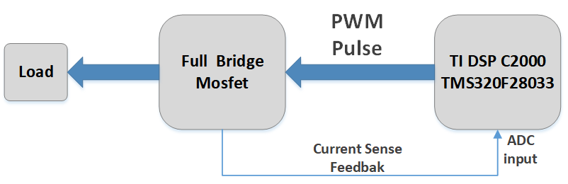

### Driving a full-bridge converter with a TI-DSP featuring a power limiter mechanism

In this project a full-bridge converter is driven by a C2000 DSP (TMS320F28033) through PWM (Pulse Width Modulation) signals. The generated PWM signals are applied to two bridge-driver chip (IR2110) which drive the power transistors. The four transistors are N-Channel Mosfet (IRFP260). This design features the capability of monitoring and controlling the amount of power driven from full-bridge to load. It behaves like an AGC (Automatic Gain Control) which prevents the full-bridge from over-loading and over-heating. The current flowing in Mosfets are repetitively sensed by a sampling resistance (without affecting the switching mechanism of Mosfets) and are read with the ADC of DSP. According to the level of current (which represents the delivered power to the load from full-bridge), the width of PWM signals changes in order to limit the maximum power. The active time of full-bridge is 2msec out of every 10msec. \
Link to the firmware code: [Firmware_main_code](DSP_Workspace/DSP_PWM_FullBridge/main.c)  
The [Command_file](DSP_Workspace/DSP_PWM_FullBridge/F28033.cmd) has been edited to manage Flash and RAM memory resources utilization. 

## Author:
### Hamid Reza Tanhaei